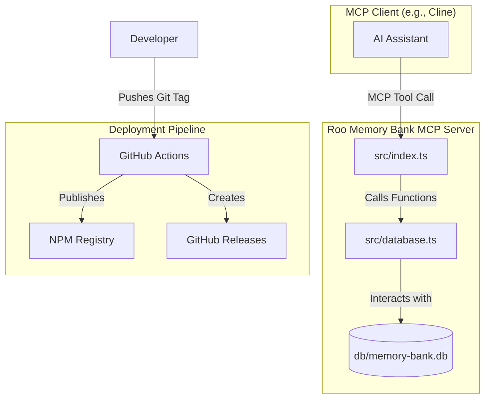

# Documentation

This directory contains comprehensive documentation for the Roo Code Memory Bank MCP Server.

## 📚 Documentation Index

### Getting Started
- [🚀 Quick Setup Guide](./quick-setup.md) - Get up and running in minutes
- [📖 Main README](../README.md) - Full project overview and basic installation

### Development & Deployment
- [🚀 Release Workflow](./release-workflow.md) - Complete guide to creating releases
- [⚙️ Deployment Guide](./deployment-guide.md) - Setting up automated CI/CD

### Project Files
- [📝 CHANGELOG](../CHANGELOG.md) - Version history and changes
- [🛠️ Package Configuration](../package.json) - NPM package settings

## 🏗️ Architecture

The server's architecture is centered around a **SQLite database** managed by the `src/database.ts` module. All MCP tools interact with this database to provide persistent storage for the AI assistant's context. The deployment and CI/CD pipeline is managed through GitHub Actions.

## 📋 Setup Checklist

For maintainers setting up the automation:

### Repository Setup
- [ ] GitHub repository created
- [ ] NPM account configured
- [ ] Repository secrets configured:
  - [ ] `NPM_TOKEN` - NPM automation token
- [ ] GitHub Actions enabled

### Local Development
- [ ] Node.js 18+ installed
- [ ] Repository cloned
- [ ] Dependencies installed (`npm install`)
- [ ] Build working (`npm run build`)

### First Release
- [ ] Update `CHANGELOG.md`
- [ ] Create git tag (`git tag v0.1.0`)
- [ ] Push tag (`git push origin v0.1.0`)
- [ ] Verify GitHub release created
- [ ] Verify NPM package published

## 🔐 Security

### Secrets Management
- **NPM_TOKEN**: Stored as GitHub repository secret
- **GITHUB_TOKEN**: Automatically provided by GitHub Actions
- **No hardcoded credentials**: All sensitive data in secrets

### Security Measures
- **Automated auditing**: NPM audit runs on every build
- **Dependency scanning**: GitHub's Dependabot enabled
- **Minimal permissions**: Tokens have only required scopes
- **Version control**: All changes tracked in git

## 🎯 Best Practices

### Version Management
- **Semantic Versioning**: Major.Minor.Patch format
- **Changelog First**: Update CHANGELOG.md before releases
- **Tag Convention**: Use `v` prefix (e.g., `v1.0.0`)

### Development Workflow
1. **Feature Development**: Work in feature branches
2. **Pull Requests**: All changes via PR
3. **Code Review**: Required before merge
4. **Automated Testing**: CI must pass
5. **Release Process**: Tag-based releases

### Quality Assurance
- **TypeScript**: Strong typing for reliability
- **Build Validation**: Ensure compilation works
- **Package Testing**: Verify installation works
- **Documentation**: Keep docs updated

## 🔄 Maintenance

### Regular Tasks
- **Dependency Updates**: Monthly security updates
- **Documentation Review**: Quarterly documentation review
- **Workflow Updates**: Update GitHub Actions as needed
- **Token Rotation**: Rotate NPM tokens annually

### Monitoring
- **GitHub Actions**: Monitor workflow success rates
- **NPM Statistics**: Track package downloads
- **Security Alerts**: Respond to vulnerability reports
- **User Feedback**: Address issues and feature requests

## 📞 Support

### For Users
- [🚀 Quick Setup Guide](./quick-setup.md)
- [🐛 Issue Tracker](https://github.com/IncomeStreamSurfer/roo-memorybank-mcp-server/issues)
- [📦 NPM Package](https://www.npmjs.com/package/roo-mcp-server)

### For Contributors
- [🚀 Release Workflow](./release-workflow.md)
- [⚙️ Deployment Guide](./deployment-guide.md)
- [🔧 GitHub Actions](../.github/workflows/)

### For Maintainers
- GitHub repository admin access required
- NPM package maintainer access required
- Knowledge of GitHub Actions workflows

---

**This automated deployment system ensures reliable, consistent releases while maintaining high code quality and security standards.**

test