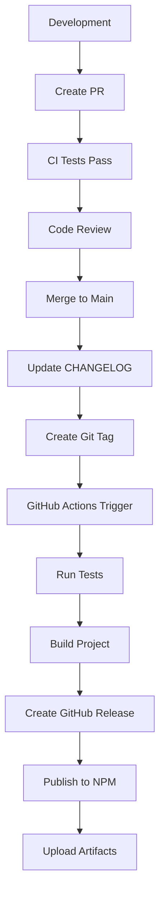

# Release Workflow

This document describes the complete release workflow for the Roo Code Memory Bank MCP Server.

## Release Process Overview



## Step-by-Step Release Guide

### 1. Pre-Release Preparation

#### Update Version and Changelog
1. **Update CHANGELOG.md**:
   ```markdown
   ## [1.0.1] - 2025-01-07
   
   ### Added
   - New feature descriptions
   
   ### Fixed
   - Bug fix descriptions
   ```

2. **Commit changes**:
   ```bash
   git add CHANGELOG.md
   git commit -m "docs: update changelog for v1.0.1"
   git push origin main
   ```

#### Verify Build
3. **Test build locally**:
   ```bash
   npm run clean
   npm run build
   npm pack --dry-run
   ```

### 2. Creating a Release

#### Method 1: Using Git Tags (Recommended)
```bash
# Create and push a new tag
git tag v1.0.1
git push origin v1.0.1
```

#### Method 2: Manual Workflow Trigger
1. Go to GitHub Actions tab
2. Select "Release and Publish" workflow
3. Click "Run workflow"
4. Enter version: `v1.0.1`
5. Click "Run workflow"

### 3. Automated Release Process

Once triggered, the workflow automatically:

1. **Runs CI Tests**
   - Tests on Node.js 18 and 20
   - Builds the project
   - Runs security audit
   - Validates package can be packed

2. **Creates GitHub Release**
   - Extracts version from tag
   - Updates package.json version
   - Generates release notes from CHANGELOG.md
   - Creates GitHub release with artifacts

3. **Publishes to NPM**
   - Authenticates with NPM using token
   - Publishes package with public access
   - Updates NPM registry

4. **Uploads Artifacts**
   - Builds distribution files
   - Uploads as GitHub release assets

### 4. Post-Release Verification

#### Verify GitHub Release
1. Check [Releases page](https://github.com/IncomeStreamSurfer/roo-code-memory-bank-mcp-server/releases)
2. Confirm release notes are correct
3. Verify artifacts are uploaded

#### Verify NPM Publication
1. Visit [NPM package page](https://www.npmjs.com/package/roo-mcp-server)
2. Confirm new version is published
3. Check package details and README

#### Test Installation
```bash
# Test global installation
npm install -g roo-mcp-server@latest

# Test local installation
npm install roo-mcp-server@latest

# Verify binary works
roo-mcp-server --help
```

## Version Strategy

### Semantic Versioning Rules

- **MAJOR** version: Breaking changes to MCP tools API
- **MINOR** version: New MCP tools or backward-compatible features
- **PATCH** version: Bug fixes and improvements

### Examples

| Change Type | Version Jump | Example |
|-------------|-------------|---------|
| Add new MCP tool | Minor | 1.0.0 → 1.1.0 |
| Fix memory bank bug | Patch | 1.0.0 → 1.0.1 |
| Change tool interface | Major | 1.0.0 → 2.0.0 |
| Update dependencies | Patch | 1.0.0 → 1.0.1 |

## Rollback Process

If a release has issues:

### 1. Quick Hotfix
```bash
# Create hotfix branch
git checkout -b hotfix/v1.0.2 v1.0.1

# Fix the issue
git commit -m "fix: critical issue description"

# Create new patch release
git tag v1.0.2
git push origin v1.0.2
```

### 2. NPM Package Unpublish
```bash
# Only within 72 hours and if no dependencies
npm unpublish roo-mcp-server@1.0.1
```

### 3. GitHub Release Management
1. Go to GitHub Releases
2. Edit the problematic release
3. Mark as "pre-release" or delete if necessary

## Troubleshooting

### Common Issues and Solutions

#### Build Fails
**Problem**: TypeScript compilation errors
**Solution**: 
```bash
npm run build
# Fix any TypeScript errors
# Re-run tests locally
npm test
```

#### NPM Publish Fails
**Problem**: Authentication or permissions issue
**Solution**:
1. Check NPM_TOKEN in GitHub secrets
2. Verify token has publish permissions
3. Ensure package name is available

#### GitHub Release Fails
**Problem**: Tag already exists or insufficient permissions
**Solution**:
1. Delete existing tag if needed:
   ```bash
   git tag -d v1.0.1
   git push origin :refs/tags/v1.0.1
   ```
2. Check repository permissions

#### Version Conflicts
**Problem**: Version already exists on NPM
**Solution**:
1. Use next available version number
2. Update package.json manually if needed

### Monitoring Release Health

#### Success Indicators
- ✅ All GitHub Actions workflows pass
- ✅ GitHub release created with correct assets
- ✅ NPM package published successfully
- ✅ Installation tests pass
- ✅ No critical security vulnerabilities

#### Health Checks
```bash
# Check package installation
npm view roo-mcp-server versions --json

# Test MCP server functionality
npm install -g roo-mcp-server
roo-mcp-server # Should run without errors

# Verify file permissions (Unix systems)
ls -la $(which roo-mcp-server)
```

## Best Practices

1. **Always test locally** before creating tags
2. **Update CHANGELOG.md** before every release
3. **Use descriptive commit messages** following conventional commits
4. **Monitor GitHub Actions** during releases
5. **Verify installations** after publishing
6. **Keep dependencies updated** for security
7. **Document breaking changes** clearly in CHANGELOG
8. **Use pre-release versions** for testing major changes

## Emergency Procedures

### Critical Security Issue
1. **Immediate response**:
   ```bash
   # Create emergency patch
   git checkout main
   git pull origin main
   
   # Fix security issue
   git commit -m "security: fix critical vulnerability"
   
   # Emergency release
   git tag v1.0.X-security
   git push origin v1.0.X-security
   ```

2. **Notify users** via GitHub Security Advisory
3. **Update documentation** with mitigation steps

### Broken Release
1. **Stop the release** if workflow is still running
2. **Create hotfix** following rollback process
3. **Communicate issue** to users via GitHub issues
4. **Document lessons learned** for future prevention